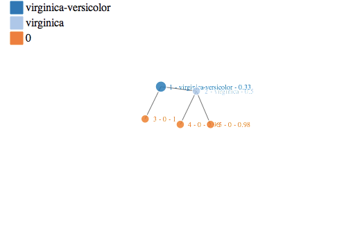

# multree
Is a multivariate decision tree classifier. This classifier constructs a decision tree where
the splitting hypersurfaces are not necessarily orthogonal hyperplanes. 

You might alternatively call these trees:

- Support vector trees
- Neural Trees

etc.


# Usage

Below are some quick steps to get this package loaded.

### Install 
Just install the package using the `devtools` package in `R`.

```
devtools::install_github("davidrdgz/multree")
```

### Training
Then you can go ahead and run a quick test on the iris data set as follows,

```
Y  <- iris[,5]
X  <- iris[,1:4]
dt <- multree(X, Y, model = SVM)
```

In this case we have constructed a supprt vector tree. 


### Testing

Now we can make some silly predictions (silly because we fit the tree with this data),

```
> p  <- m.predict(dt, X)
> table(pred = p, actu = Y)

            actu
pred         setosa versicolor virginica
  setosa         50          0         0
  versicolor      0         48         1
  virginica       0          2        49
```

So we see that our support vector tree classifies. An interesting note is to compare this performance with a traditional suppport vector machine.


### Plotting


Further, we can take a look at our tree,


```
force.graph(dt)
```



The noticeable difference here, compared to CART or ID3 decision trees, is the size. Alternatively, check the `unitree` github page. Here the decision tree is small and of a depth comparable to the number of classes we began with.

# Why

A multivariate decision tree classifier addresses the problems traditionally encountered with decision trees. Some issues that
arise with traditional decision trees are

- Large tree sizes
- Over-Under fitting
- Class dependency

# Features
Probably the most important feature of this package is the variety of multivariate splitting criterias. For example, you can choose from

- Generalized linear models
- Support vector machines
- Neural networks
- Linear discriminant analysis
- Linear models

The performance of the multivariate decision tree fitted from one of these methods will depend on your use case.

# Plots

An important part of analysing decision trees is to look at their structure. This package utilizes the networkD3 package
to give an insight into the majority of the class and their percentage of each node in the tree.


